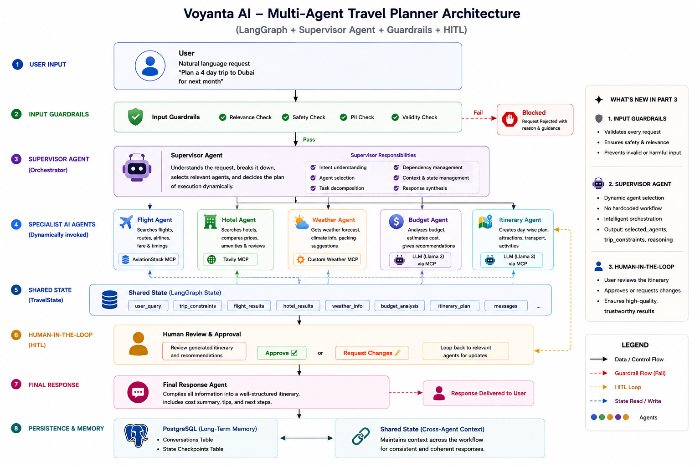

# Voyanta AI

Voyanta AI is a multi-agent travel planner built with LangGraph, MCP, FastAPI, and React. It uses a supervisor-led workflow, input guardrails, specialist travel agents, streaming progress updates, and human approval to produce reviewable travel itineraries.

## What it includes

- LangGraph orchestration with a supervisor and specialist agents
- Flight, hotel, weather, budget, and itinerary planning agents
- MCP integrations for Tavily and custom weather tooling
- Input guardrails for travel-planning requests
- Human-in-the-loop draft approval and revision feedback
- Server-sent event (SSE) streaming for live workflow progress
- React 19 + TypeScript + Vite frontend
- Trip history stored in the browser and client-side light/dark theme support
- Markdown rendering, copy-to-clipboard, and PDF export
- FastAPI API and SPA fallback for client-side routes
- Docker image that builds the React app and runs the FastAPI server

## Architecture

The backend coordinates the travel-planning graph, while the React frontend communicates with it through JSON and SSE endpoints:

```text
React + Vite frontend
          |
          v
FastAPI API and SPA server
          |
          v
LangGraph supervisor and specialist agents
          |
          +--> AviationStack flight data
          +--> Tavily hotel/web search
          +--> Custom weather MCP server
          +--> PostgreSQL checkpointing
```

<p align="center">
  
</p>

## Project structure

```text
.
├── app.py                         # FastAPI app, API routes, and frontend serving
├── backend.py                     # LangGraph workflow and travel agents
├── mcp_client.py                  # MCP client configuration and helpers
├── custom_weather_mcp_server.py   # Custom OpenWeather MCP server
├── tools/                         # Flight and Tavily helper tools
├── templates/index.html            # Legacy Jinja2 frontend fallback
├── static/                        # Legacy frontend CSS and JavaScript
├── web/                           # React + TypeScript + Vite frontend
│   ├── src/routes/                # Trip, history, settings, auth, and info pages
│   ├── src/features/planner/      # Planner form, workflow, approval, and export UI
│   ├── src/components/            # Shared and UI components
│   └── package.json               # Frontend scripts and dependencies
├── assets/                        # Architecture diagram and favicon
├── requirements.txt               # Python dependencies
├── Dockerfile                     # Multi-stage frontend and backend image build
└── .env.example                   # Environment variable template
```

## How the workflow works

1. A user submits a travel request from the React planner.
2. The input guardrail validates the request.
3. The supervisor selects the specialist agents needed for the request.
4. The agents research and prepare a draft itinerary.
5. The frontend receives live node updates through an SSE stream.
6. The user approves the draft or submits revision feedback.
7. The final itinerary can be copied or exported as a PDF.

## Prerequisites

- Python 3.10 or newer
- Node.js 20.19+ or 22.12+ and npm
- PostgreSQL, if using persistent LangGraph checkpointing
- API keys for the external services used by your configuration

## Environment configuration

Copy the example file and fill in the values needed by your setup:

```powershell
Copy-Item .env.example .env
```

The available variables are:

- `GROQ_API_KEY` - LLM used by the supervisor and specialist agents
- `TAVILY_API_KEY` - Tavily search used by the hotel agent
- `AVIATIONSTACK_API_KEY` - flight and airport data
- `OPENWEATHER_API_KEY` - weather data used by the custom MCP server
- `DATABASE_URL` - PostgreSQL connection string for LangGraph checkpoints
- `DEFAULT_ORIGIN_IATA` - default departure airport IATA code
- `LANGSMITH_API_KEY` - optional LangSmith tracing key
- `LANGSMITH_TRACKING` - optional LangSmith tracing toggle
- `LANGSMITH_ENDPOINT` - optional LangSmith endpoint
- `LANGSMITH_PROJECT` - optional LangSmith project name

Do not commit your `.env` file or real API keys.

## Local development

### 1. Install backend dependencies

```powershell
python -m venv .venv
.venv\Scripts\Activate.ps1
pip install -r requirements.txt
```

### 2. Start the FastAPI backend

From the repository root:

```powershell
python app.py
```

The API runs at `http://127.0.0.1:8000`.

### 3. Start the React development server

In a second terminal:

```powershell
cd web
npm ci
npm run dev
```

Open the Vite URL shown in the terminal, usually `http://localhost:5173`. The Vite development server proxies `/api` requests to the FastAPI server on port 8000.

## Production-style local run

Build the React frontend, then start FastAPI from the repository root:

```powershell
cd web
npm ci
npm run build
cd ..
python app.py
```

The built files are written to `web/dist`. When that directory exists, FastAPI serves the React SPA at `http://127.0.0.1:8000`. If it has not been built, the app falls back to the legacy Jinja2 page in `templates/index.html`.

Useful frontend commands from `web/`:

```powershell
npm run dev      # Start Vite with hot reload
npm run build    # Type-check and create a production build
npm run lint     # Run Oxlint
npm run preview  # Preview the production build with Vite
```

## Docker

The Dockerfile uses a multi-stage build: Node builds the React frontend, and Python runs the FastAPI application with the generated `web/dist` files.

```powershell
docker build -t voyanta-ai .
docker run --env-file .env -p 8000:8000 voyanta-ai
```

Then open `http://localhost:8000`.

## React frontend routes

- `/trips/new` - start a new trip
- `/trips/:threadId` - view or continue a trip
- `/history` - view trips saved in the browser
- `/settings` - frontend settings
- `/login` and `/signup` - frontend auth screens
- `/how-it-works`, `/about`, and `/privacy` - informational pages

## API endpoints

### `POST /api/travel`

Create a planning run or continue an existing thread.

```json
{
  "message": "Plan a five-day trip to Kyoto",
  "thread_id": "optional-thread-id"
}
```

### `POST /api/travel/stream`

Start a planning run and receive workflow events as an SSE stream. The request body is the same as `/api/travel`.

### `POST /api/travel/approve`

Approve a draft or request revisions.

```json
{
  "thread_id": "thread-id",
  "approved": false,
  "feedback": "Add a day trip and choose a hotel closer to the station."
}
```

### `POST /api/travel/approve/stream`

Resume an approval or revision decision and receive workflow events as an SSE stream. The request body is the same as `/api/travel/approve`.

### `GET /api/travel/{thread_id}`

Fetch the current state and result for a travel thread.

### `GET /health`

Return a basic API health response.

## Optional weather MCP server

The custom weather MCP server can be run independently for experimentation:

```powershell
python custom_weather_mcp_server.py
```

The application configures this server through `mcp_client.py` when weather tools are requested.

## Notes

- Authentication screens are currently frontend routes; the repository does not include a user-account backend.
- Trip history is stored locally in the browser by the React frontend.
- The project demonstrates orchestration and approval patterns and is not yet production-hardened.
- Automated tests are not currently included.

## Contributing

Contributions are welcome, including documentation improvements, bug fixes, frontend polish, new agents, and MCP adapters. Please open an issue or submit a pull request.

## License

This project is licensed under the terms in [LICENSE](LICENSE).
